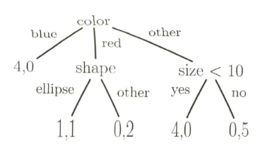

# Decision Trees

Suitable when the data features are not numeric \(discrete\)

Intuition: Any finite Pattern can be represented by a finite series of yes/no question.

* Directed Graph $$G = <N, E>$$
* Each node represents a choice on a particular variable feature F amonst B subsets of thew values of F. 
* Edges connect a node to child nodes 
* Leaf nodes are nodes with no children which have a category label assigned to them
* leaves form a partition of the data
* A decision tree categorizes a data point according to the label of the leaf node that data point reaches by following the rules defined in the internal nodes.

**Impure Leaf:** if all the datapoints remaining at a node have the same class label, the leaf is pure otherwise it is mixed or impure.

For a binary classification problem, the counts of the remaining datapoints in each partition can be reported.

A decision tree recursively partitions the input space, defining a local model in each resulting region of the input space represented by a leaf node.

If all the dimensions are numerical we can envision what the decision tree is doing as dividing up space into rectangles.

Decision trees allow us to combine numerical and non-numerical data dimensions into a single learning process.

## CART

A generalization of decision trees is the Classification and Regression Tree \(CART\) framework.

The decision tree have the following questions to be solved:

* Which feature will tested at each node?
* When should a node become a leaf?
* Can a tree be too large? how to make it smaller?
* If a leaf is impure, what label do we assign?
* How do we deal with missing data?

### Splitting Nodes

Number of split choices is the **branching fractor** of the tree. We can represent any multiple branch split with a series of binary splits.

Using a higher branching fractor raises the risk of overfitting.

### Cost as Node Impurity

Basic principle, we want the simplest model at each node, a leaf node is pure if all the datapoints associated with it are having the same label. \($$impurity cost(D) = 0$$ in this case\)

* Misclassificaiton impurity: Intuitive but generally not as good as others
* Entropy Impurity: most popular
* Gini Impurity: Useful for training trees

Given a partial tree, deciding on node D, chosen the feature to split on

The best split is the one that maximizes $$\Delta cost(D)$$, that is maximizing the information gain of the split.

$$
\begin{equation}
\Delta cost(D) = cost(D) - ( \frac{|D_L|}{D}cost(D_L) + \frac{|D_R|}{D}cost(D_R) )
\end{equation}
$$

### Stop splitting Criteria

We should stop splitting by one of the following criteria:

* Simplest Approach: keep splitting until each leaf are pure leaf \(tends to **overfit**\)
* Minimize Cross **Validated Error**: Measure the descrease in error a new node would cause against a validation set.
* Threshold: Stop splitting if proposed split provides $$< \epsilon$$ reduction in **impurity \(cost\)**
* Minimize Global Criterion: setting a **global criterion** on tree size \(**number of nodes**, **branch lenghth** etc...\), actting as a **regularizer that discourages larger trees**.

## Pruning the Tree

The **Horizaon Effect** on Stop **Splitting the tree**:

* Stop too early the model underfits
* Stop too late it overfits
* Cant see later horizon unless you explore it
* So why not fully grow the tree first then decide what to remove?

Basic Steps:

1. Grow a full tree: until leaf node impurity hits a minimum or very small number of datapoints in leaf.
2. Find a pair of sibling leaf node i and j which have not yet been examined
3. Calculate how much impurity of parent node k would go up if i and j were eliminated then remove branches thatwould cause the smallest increase in error.

**Comments on Pruning**:

* \(PROs\) All the data can be used for training unlike the threshold cross validation approaches
* \(PROs\) Avoids the horizon effect
* \(CONs\) More expensive than computing when to stop early

## Comment on Decision Trees

Pros:

* Simple to implement, lots of flexibility in impurity measures, training algorithms
* Resulting model is easy to interpret as logical rules
* Can be seen as an automated kernal learning method, similar to neural networks
* Universal expressive power 
* Handle nominal, discrete and continous data

Cons:

* Very easy to overfit the data, create a complete mapping
* Tend to be unstable, small changes in input lead to very different trees,
* Fairly slow to train \(not as bad as Neural Networks\)

