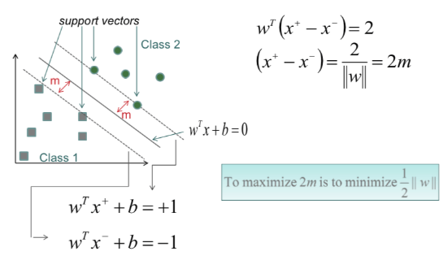

# Support Vector Machines

The goal of classificaiton using SVM is to separate teo classes by a hyperplane induced from the available examples. Will work on unseen examples \(generalize well\)

The hyper plane equation is $$w^Tx + b = 0$$

In order to achieve optimal separation

* No errors
* The distance from the closest vector to the hyper plane is maximized 

The vectors closest to the hyper plane are called support vectors.

**Possible Problems for Linear SVM**:

* If the data is not linearly separable
* If some noise introduced and we can allow some error on the training data

## Soft Margin SVM

The optimization problem becomes

Minimize $$v(w,b,\zeta) = \frac{1}{2}\|w\|^2 + c\sum \zeta$$ subject to $$y_i(w^Tx_i + b) \ge 1 - \zeta_i, \forall i$$

## Nonlinear SVM

SVM can be easily transformed into a non-linear learner. The vector $$x_i$$ are transformed into a higher dimension feature space using a non-linear mapping $$\phi (x_i)$$

### Kernel Trick

Computing $$\phi (x_i)$$ is computationally inefficient, notice that in the formulation of the of the optimization $$x_i^Tx_j$$ we have dot product, we need to compute $$<\phi (x_i), \phi (x_j)>$$ without computing $$\phi (x)$$ so we can use kernel function $$k(x_i, x_j)$$ to effectively compute it.

In practice, we specify kernel function K thereby specifying $$\phi (x)$$ indirectly, instead of choosing $$\phi (x)$$.

支持向量机的优点是:

* 由于SVM是一个**凸优化问题，所以求得的解一定是全局最优**而不是局部最优。
* 不仅适用于线性线性问题还适用于非线性问题\(用核技巧\)。
* 拥有高维样本空间的数据也能用SVM，这是因为数据集的复杂度只取决于支持向量而不是数据集的维度，这在某种意义上避免了“维数灾难”。
* 理论基础比较完善\(例如神经网络就更像一个黑盒子\)。

支持向量机的缺点是:

* 二次规划问题求解将涉及m阶矩阵的计算\(m为样本的个数\), 因此SVM**不适用于超大数据集**。\(SMO算法可以缓解这个问题\)
* 只适用于二分类问题。\(SVM的推广SVR也适用于回归问题；可以通过多个SVM的组合来解决多分类问题\)

