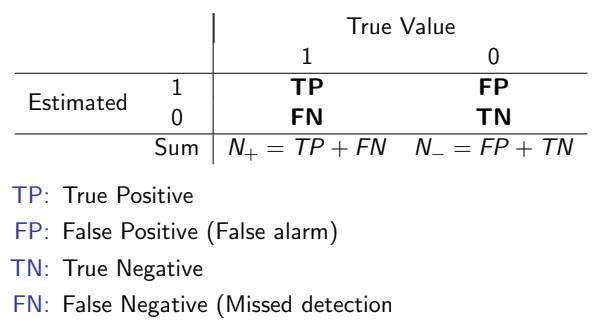
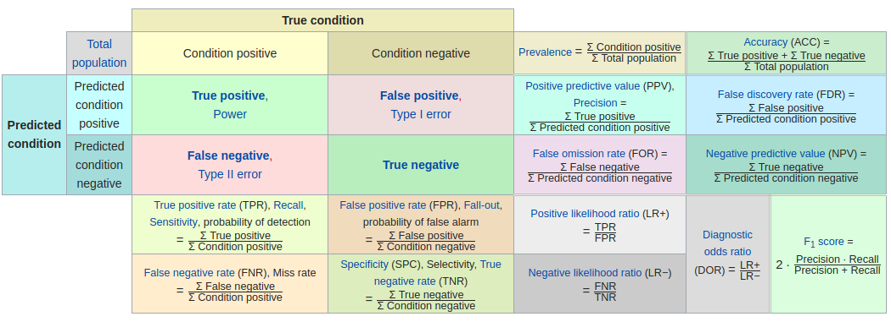
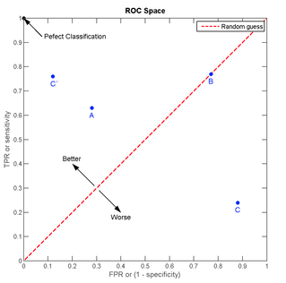
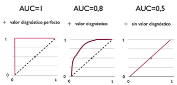
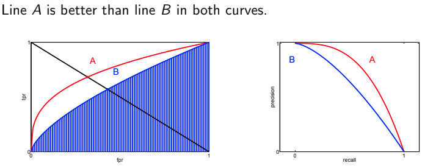
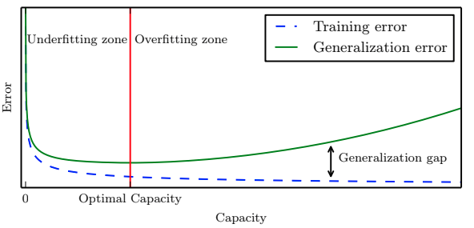

# Training, Validation and Error Estimation

## Performance Measures: Confusion Matrix

a confusion matrix, also known as an error matrix, is a specific table layout that allows visualization of the performance of an algorithm, typically a supervised learning one \(in unsupervised learning it is usually called a matching matrix\). Each row of the matrix represents the instances in a predicted class while each column represents the instances in an actual class \(or vice versa\).

It is a special kind of contingency table, with two dimensions \("actual" and "predicted"\), and identical sets of "classes" in both dimensions \(each combination of dimension and class is a variable in the contingency table\).

Note that we can also compute various success and error rates:

## Receiver Operating Characteristic \(ROC\)

分类模型（又称分类器，或诊断）是将一个实例映射到一个特定类的过程。ROC分析的是二元分类模型，也就是输出结果只有两种类别的模型，例如：（阳性／阴性）（有病／没病）（垃圾邮件／非垃圾邮件）（敌军／非敌军）。

ROC空间将伪阳性率**（FPR, Type I error, false alarm rate）定义为 X 轴**，**真阳性率（TPR, Sensitivity/Recall）定义为 Y 轴**。 h 给定一个二元分类模型和它的阈值，就能从所有样本的（阳性／阴性）真实值和预测值计算出一个 \(X=FPR, Y=TPR\) 座标点

* 点与随机猜测线的距离，是预测力的指标：离左上角越近的点预测（诊断）准确率越高。离右下角越近的点，预测越不准。
* 在A、B、C三者当中，最好的结果是A方法。
* B方法的结果位于随机猜测线（对角线）上，在例子中我们可以看到B的准确度（ACC，定义见前面表格）是50%。
* C虽然预测准确度最差，甚至劣于随机分类，也就是低于0.5（低于对角线）。然而，当将C以 \(0.5, 0.5\) 为中点作一个镜像后，C'的结果甚至要比A还要好。这个作镜像的方法，简单说，不管C（或任何ROC点低于对角线的情况）预测了什么，就做相反的结论。

### ROC Curve

上述ROC空间里的单点，是给定分类模型且给定阈值后得出的。但同一个二元分类模型的阈值可能设定为高或低，每种阈值的设定会得出不同的FPR和TPR。

将同一模型每个阈值 的 \(FPR, TPR\) 座标都画在ROC空间里，就成为特定模型的ROC曲线。

在比较不同的分类模型时，可以将每个模型的ROC曲线都画出来，比较曲线下面积做为模型优劣的指标。

ROC曲线下方的面积（**Area under the Curve \(AUC\)** ），其意义是：

* 因为是在1x1的方格里求面积，AUC必在0~1之间。
* 简单说：AUC值越大的分类器，正确率越高。
* 从AUC判断分类器（预测模型）优劣的标准：
* AUC = 1，是完美分类器，采用这个预测模型时，存在至少一个阈值能得出完美预测。绝大多数预测的场合，不存在完美分类器。
* 0.5 &lt; AUC &lt; 1，优于随机猜测。这个分类器（模型）妥善设定阈值的话，能有预测价值。
* AUC = 0.5，跟随机猜测一样（例：丢铜板），模型没有预测价值。
* AUC &lt; 0.5，比随机猜测还差；但只要总是反预测而行，就优于随机猜测。

### P-R curve

We can plot **precision** vs **recall** as well, precision-recall curve can often show us different performance behavior from the ROC curve.

The P-R only uses statistics on TP, so the curve is **useful when there is a very small number of positive cases** in your classifier or when the **number of negatives could scale** based on some parameter.

Curve bends the other way.

## Underfitting, Overfitting and Capacity

**Generalization** is the ability to perform well on previously unobserved inputs.

**Generalization Error** is the expected error on new inputs.

The easiest way to avoid overfitting is to have a very large training data.

* Redeuce model complexity
* Choose model generalize well
* **Regularization**

**Regularization** us a process introducing additional information in order to solve an oll posed problem or to prevent overfitting

Examples:

* L1 and L2 regularization
* Early stoppinf
* Model Validation \(stop based on error on validation data\)

## Error Estimation Methods

* Resubstitution method : Use all the availabel data  for training and same data for testing \(optimistically biased estimate\)
* Holdout Method : Use half data for training and the other for testing \(pessimistically biased estimate\)
* Leave-one-out Method: Estimate is unbiased but has a large variance, with large computational requirement
* K-fold corss validation: Divide the available samples into K disjoint subsets for training and the remaining subset for test, Estimate has lower bias than the hold out method and cheaper to implement than leave-one-out
* Bootstrap Method: Generate many bootstrap sets of size n by sampling with replacement.
  * Bootstrap estimates can have lower variance than the leave-one-out method
  * Computationally more demanding
  * Useful in small size data

## Capacity

Ability of a model to fit a wide variety of functions.

