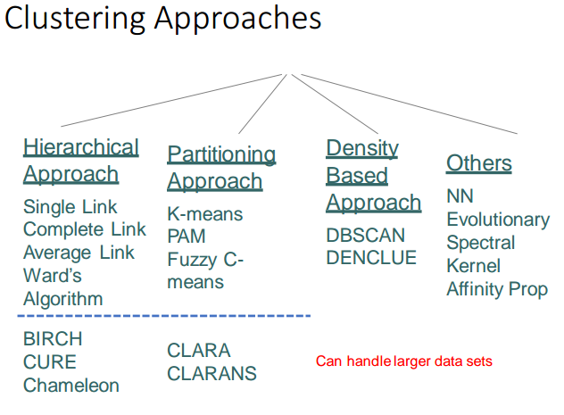

# Clustering problem

**Given:** a set of data instances \(e.g., documents,images\), a representation for data instances

**Goal:** Divide data instances into groups, data instances into each group are similar, data instances into different groups are dissimilar

**Constraint:** No prior knowledge of the labels or classes of the pattern \(unsupervised\)

The following problems need to be solved for data clustering:

* How should we represent the patterns?
* What should we use as a similarity measure?
* How to decide on the number of clusters?
* How to actually group the patterns, i.e. what is the clustering criteria?
* How should we assess the results \(performance measures\)?
* How to interpret the resulting clusters

## Notation

Patterns can be represented as multidimensional vectors, each dimension is a single feature

$$x = \{f_1, f_2, ..., f_d\}$$

Clusters are sets: $$C_1 = \{x_1, x_4, x_5\}$$, $$C_2 = \{x_2, x_3\}$$

Distance between points $$d(p_i, p_j)$$ or clusters $$d(C_i, C_j)$$ describes some measure of dissimilarity between them

## Clustering Criteria

Objective or cost function or rule to be evaluated during the process of clustering

For example:

* Min sum of squared errors from reference or statistics \(means,

  modes\)

* Min intra-cluster distances
* Max inter-cluster distances
* Max number of common neighbors
* Distance Density

