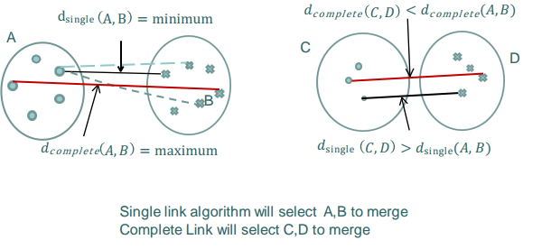
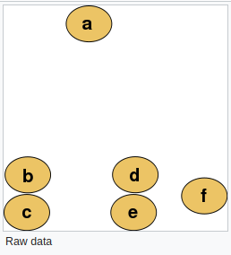
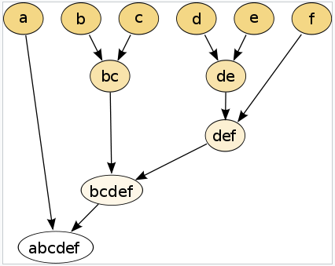
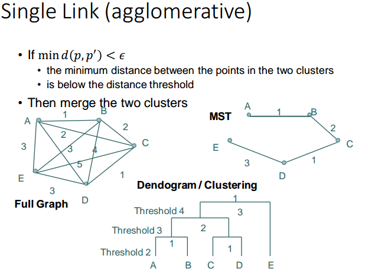

# Hierarchical Approach

Use nested sets of clusters

* **Agglomerative:** start with each pattern in one cluster and merge close clusters until stopping criteria is satisfied
* **Divisive:** start with all patterns in one cluster and keep on dividing the dissimilar ones

## Agglomerative Algorithms

From current clusters, merge the two clusters that have the minimum distance between the clusters

**Option 1: Single Link**

The distance between 2 clusters is the minimum of the distance between all pairs of patterns

$$
\begin{equation}
d(C_i, C_j) = \min d(p, p'), ~ p\in C_i, p' \in C_j
\end{equation}
$$

**Option 2: Complete Link**

The distance between 2 clusters is the maximum of all pairwise distance between the patterns

$$
\begin{equation}
d(C_i, C_j) = \max d(p, p'), ~ p\in C_i, p' \in C_j
\end{equation}
$$

**Option 3: Average Link** Take average of distances. In both cases, the merge is done based on minimum distance between clusters.

$$
\begin{equation}
d(C_i, C_j) = \frac{1}{n_i n_j} \sum_{p\in C_i}\sum_{p'\in C_j} d(p, p')
\end{equation}
$$

Space and Time Complexity = $$O(n^2)$$

## Divisive Algorithm

Reverse the process!

* Split elements which are not sufficiently close.
* Use a threshold and minimum spanning tree \(MST\)
* One can look at it from a graph point of view \(nodes are patterns, links are distances\)
* Find the minimum spanning tree \(corresponds to minimum distance\), merge based on order of distances in MST

## Ward's Algorithm

It is a Meta-algorithm for agglomerative hierarchical clustering, at each step, an objective function is used to determine if two clusters should be merged or not

**More efficient:** Instead of computing new distances between all new clusters just update the distance between the new cluster and other clusters:

For single link merging of $$C_p, C_q$$ in to $$C_t$$, the distance for the new cluster with other cluster can be updated by

$$
\begin{equation}
d(C_t, C_l) = \min ( d(c_l, c_p) , d(c_l, c_q)) 
\end{equation}
$$

Update by deleting rows and columns corresponding to p and q and adding a row corresponding to the new cluster

Note that $$C_l$$ is the existing cluster.

**Ward's Minimum Variance Algorithm:** Min variance based – minimizes the total within-cluster variance \(tight clusters\), by computing the square of errors for each cluster \(from the mean\) then merge pair of cluster p and q that minimize the change in total score of variance.

## Comments on Hierarchical Clustering

Hierarchical Clustering is sometimes called connectivity based clustering

Most common criticism of the previous HC algorithms is **lack of robustness**, and hence **sensitivity to noise**, **outliers**, and their **complexity**\($$O(n^2)$$ in time and space\)

* cannot handle large data well

