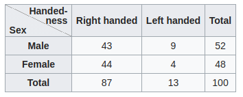
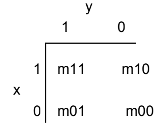

# Measuring Data Similarity

A measure of how two data objects are close to each other, the more similar the objects, the higher the value

Proximity 邻近性 is used o express similarity

## Distance Matrix

A distance matrix is a table that shows the distance between pairs of objects. Given n data pints, each is the distance between pairs of points.

**Data \(Sample\) matrix:** n data samples with d dimensions \(features\)

$$
\begin{equation}
\begin{bmatrix}
x_{11} & ... & x_{1r} & ... &x_{1d}\\
...  & ... & ... & ... &...\\
x_{i1} & ... & x_{ir} & ... &x_{id}\\
...  & ... & ... & ... &...\\
x_{n1} & ... & x_{nr} & ... &x_{nd}
\end{bmatrix}
\end{equation}
$$

**Distance matrix:** a triangular matrix measuring the distance

$$
\begin{equation}
\begin{bmatrix}
0    &     &     &     &\\
d_{21} & 0 &    &      & \\
d_{31} & d_{32} & 0 &   & \\
...  & ... & ... & ... &...\\
d_{n1} & d_{n2} & ... & ... &0
\end{bmatrix}
\end{equation}
$$

## Measures for binary types

Given two binary vectors $$x$$ and $$y$$ of $$d$$ dimensions each

* **Dot Product** $$x^Ty$$ measures the number of attributs of value 1 shared between the two vectors
* **Hamming Distance** $$\sum_{i=1}^d |x_i - y_i|$$ measures the number of attributes that have different values in the two vectors
* **Tanimoto Measure** $$t(x,y) = \frac{x^Ty}{x^Tx + y^Ty - x^Ty}$$ measures the common attributes relative to the non-commmon elements

**Contingency table** can be used to define of number of other proximity measures \(table couting binary attributes of x and y\)

Suppose there are two variables, sex \(male or female\) and handedness \(right or left handed\). Further suppose that 100 individuals are randomly sampled from a very large population as part of a study of sex differences in handedness. A contingency table can be created to display the numbers of individuals who are male right handed and left handed, female right handed and left handed. Such a contingency table is shown below.

**Simple Matching Coefficient \(SMC\)**: Similiarity with equal weight given to 0 and 1

$$
\begin{equation}
\frac{m_{00} + m_{11}}{m_{00} + m_{00} + m_{01} + m_{10}}
\end{equation}
$$

**Jaccard Coefficient \(JC\)**: Similarity ignoring 0-0 matches

$$
\begin{equation}
\frac{m_{11}}{m_{00} + m_{01} + m_{10}}
\end{equation}
$$

* SMC and JC always less than 1
* values of 1 means the two vectors are identical
* \(1-SMC\) yields distance
* \(1-JC\) yields jaccard distance

## Distance Metric

For all vectors $$x$$, $$y$$, $$z$$ the function $$d$$ is a metric iff

* $$d(x,x) = 0$$ where $$d(x,y)=0$$ iff $$x = y$$
* $$d(x,y) \ge 0$$ non-negativity
* $$d(x,y) = d(y,x)$$ symmetry
* $$d(x,y) \le d(x,z) + d(z,y)$$ triangle inqeuality

### Minkowksi Metric

$$
\begin{equation}
d_k(x,y) = \[ \sum_{i=1}^n |x_i - y_i|^k \]^{\frac{1}{k}}
\end{equation}
$$

* k=1, we get the $$L_1$$ norm, also called aboluste norm or manhattan distance
* k=2, we get the $$L_2$$ norm or euclidean distqance

### Cosine Similarity

The similarity between two vectors x and y is measured as the cosine of the nalge of the two vectors: $$\cos(x,y) = \frac{x^Ty}{\|x\|\|y\|}$$

* Value range from -1 \(opposite\) to 1 \(same except for length\)
* Useful measure for similarity that is widely used in data minning especially for sparse vectors
* Focuses on the shared non-zero attribute values and ignores any 0-\* matches between the two vectors

