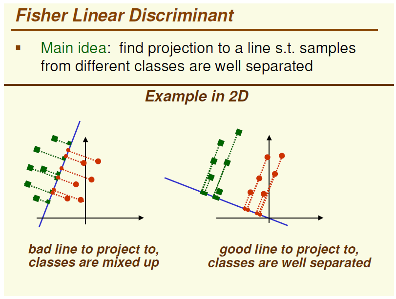

# Linear Methods

## Principal Component Analysis \(PCA\)

A way to linearly transform a set of d-dimensional vector $$x\_1, x\_2, ..., x\_n$$ into another set of m-dimensional vectors

The main idea is that high information corresponds to high variance, the direction of max variance is parallel to the eigenvector, corresponding to the largest eigenvalue of the covariance matrix of the sample matrix A.

Let $$R = A^TA$$ be the covariance matrix of $$A$$ where A is normalized by substracting mean, R is symmetric positive definite it eigenvlues are real and positive. Now we apply an orthogonal transformation to R to diagonalize it:

$$
\begin{equation}
CRC^T = \Lambda_d
\end{equation}
$$

The sorted eigenvalues of R is  $$\lambda\_1 \ge \lambda\_2...\ge \lambda\_d \ge 0$$

_Note:_ we can choose $$m$$ by

$$
\begin{equation}
r_m = \frac{\sum_{i=1}^m \lambda_i }{\sum_{i=1}^d \lambda_i} \ge \tau  
\end{equation}
$$

e.g. choosing $$\tau = 0.95$$ will ensures that 95% of the variance is retained in the new space.

_Note:_ Covariance matrix $$R = A^TA$$ is $$d\times d$$ matrix which make the computation too complex, we can use singular value decomposition instead.

### Singular Value Decomposition

The matrix A can be decomposed using SVD $$A\_{n\times d} = USV^T$$ where

* U is a $$n\times d$$ matrix of orthonomal columns $$U^TU = I$$
* V is a $$n\times d$$ matrix of orthonomal columns $$V^TV = I$$
* S is a $$d\times d$$ diagonal matrix of singular values

SVD can be used to obtain PCA, Now $$R = A^TA = VS^2V^T$$

* PCA is _optimal_ in the sense of minimize sum of square of errors. It mainly rotates the coordinates to find new axes that have the max variance.
* The PCA may not be the best for discriminating between classes. PCA认为一个随机信号最有用的信息体包含在方差里，为此我们需要找到一个方向 $$w\_{1}$$，使得随机信号x在该方向上的投影$w\_1^T x$的方差最大化

通过PCA，我们可以得到一列不相关的随机变量,至于这些随机变量是不是真的有意义，那必须根据具体情况具体分析。最常见的例子是，如果x的各分量的单位（量纲）不同，那么一般不能直接套用PCA。比如，若x的几个分量分别代表某国GDP, 人口，失业率，政府清廉指数，这些分量的单位全都不同，而且可以自行随意选取：GDP的单位可以是美元或者日元；人口单位可以是人或者千人或者百万人；失业率可以是百分比或者千分比，等等。对同一个对象（如GDP）选用不同的单位将会改变其数值，从而改变PCA的结果；而依赖“单位选择”的结果显然是没有意义的。 量纲对PCA影响比较大，数据最好应当Normalization.

## Independent Component Analysis \(ICA\)

PCA uses 2nd order stats \(mean and variance\)

Linear Projection methods can use higher order stats so they can be used for non-Gaussian distributed data: e.g. ICA

ICA was proposed for blind source separation of signals, it finds projections that are independent but may not be orthogonal.

设有 d 个独立的标量信号源发出信号，其在时刻t发出的声音可表示为 $$s_t=\(s_{1t},s_{2t},...,s_{dt}\)$$ 。同样地，有 d 个观测器在进行采样，其在时刻 t 记录的信号可表示为：$$x\_t \in R^d$$ 。认为二者满足下式，其中矩阵 A 被称为mixing matrix，反映信道衰减参数：

$$
\begin{equation}
x_t = As_t
\end{equation}
$$

显然，有多少个采样时刻，就可以理解为有多少个样本；而信号源的个数可以理解为特征的维数。ICA的目标就是从 x 中提取出 d 个独立成分，也就是找到矩阵unmixing matrix $$W = A^{-1}$$

Typically, ICA is not used for reducing dimensionality but for separating superimposed signals. Since the ICA model does not include a noise term, for the model to be correct, **whitening must be applied**. This can be done internally using the whiten argument or manually using one of the PCA variants.

* Projection pursuit uses a measure of interestingness of a projection
* Data is reduced by removing componets along the projection of Gaussian distribution \(去噪声\)
* Extract signal is as non-Gaussian as possible, so we can maximize the negative entropy \(Gaussian is the maximum entropy distribution\)

## Linear Descriminant Analysis \(LDA\), Supervised

If we know the labels of the data \(classes\) we can use discriminant analysis. The intuition is maximize the between-class scatter while holding fixed within-class scatter.

### Fisher Linear Discriminant \(2-Class LDA\)

FLD is a special case of LDA when consider the 2 class problem, we have n samples x each of d dimensions divided into 2 classes, where C1 has n1 samples, C2 has n2 samples.

We want to project these onto a line w such that the projected n points y are divided into 2 classes $$y = w^Tx$$, have a projection that separates the projected points into 2 classes.

### Generalization of FLD to K classes

Given K classes, we find a projection into \(K-1\) dimensional subspace, we the problem reduces to find a $$\(K-1\) \times d$$ projection matrix such that the projected sample poins are well separated $$y = W^Tx$$

当样本数量远小于样本的特征维数，样本与样本之间的距离变大使得距离度量失效，使LDA算法中的类内、类间离散度矩阵奇异，不能得到最优的投影方向，在人脸识别领域中表现得尤为突出

- LDA不适合对非高斯分布的样本进行降维

- LDA在样本分类信息依赖方差而不是均值时，效果不好

- LDA可能过度拟合数据

