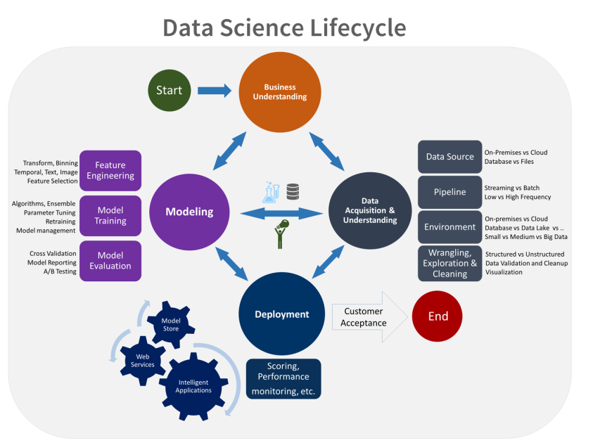
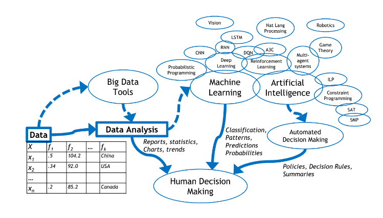
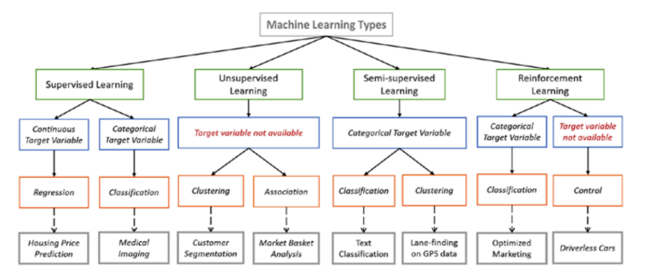

# Introduction

### Big Data

Big data is about quality and performance given huge amounts of data.

**Volume** - Large amounts of data, social networks, phone, location, embedded systems, environmental, satellites, ”full firehose” 

**Velocity** - Streaming, online data, arriving quickly, time series, real-time 

**Variety** - Heterogeneous \(many types\), many sources, category data, numerical data, continuous/discrete, text, images, audio, video

### Types of Machine Learning

Machine Learning: ”Detect patterns in data, use the uncovered patterns to predict future data or other outcomes of interest” – Kevin Murphy, Google Research.

