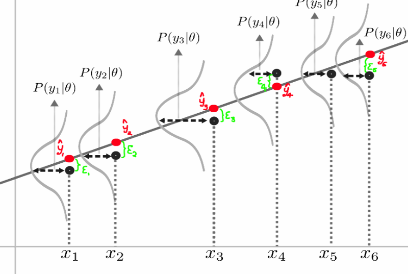

# Linear Regression

A set of data are with the samples $$(x_i, y_i)$$ where the $$x_i$$ is input vector with feature as $$x_i = (x_{i1}, x_{i2}, ... x_{id})$$ and $$y$$ is the target output. For the regression task, the target output usually is real number $$y \in \mathbb R$$ .

We can tell weather x and y exist linear/nonlinear statistical relation by observing the Correlation where

$$
Cor (X, Y) = \frac{Cov(X,Y)}{S_XS_Y},~ Cov = \frac{1}{l-1} \sum_{i=1}^{l}(x_i - \bar x) (y_i - \bar y)
$$

and the $$S_X, S_Y$$ are the estimates of standard deviations for X observations and Y observations respectively.

**Linear relation:** If Cor\(Y,X\) is close to 1, it means that we have a positive linear relation \(The slop is positive\). If Cor\(Y,X\) is close to -1, it means that we have a negative linear relation.

**Non-linear relation:** If Cor\(Y,X\) is close to zero, it means that we do not have any linear relation.

```text
# example of the correlation calculation
import pandas as pd
import numpy as np
import scipy

X = np.linspace(-5,5,100)
Y = X**2 + 2* np.random.rand(100)
scipy.stats.pearsonr(X,Y) # would output a correlation close to 0
```

## **Linear Model:**

propose the hypothesis on the input and output that trying to fit a linear relationship between them.

$$
h(x) = w_1x_1 + w_2 x_2 + ...+ w_dx_d + b
$$

where the weight terms are coefficient of the model and bias b is a unknown constant we need to solve, so in total there will be d+1 parameters. We can also make it even simple that assume a fake feature that always be 1, then the bias can be viewed as a weight as well, that is $$h(x) = w^Tx$$ .

For a group of $$l$$ sample inputs \(aka a test data set\) X, we can rewrite the hypothesis in vector form as

$$
h(X) = Xw, ~~X = \begin{bmatrix}
    x_{11} & x_{12}   & \dots  & x_{1d} & 1 \\
    x_{21} & x_{22}  & \dots  & x_{2d}  & 1\\
    \vdots & \vdots & \ddots & \vdots   & \vdots \\
    x_{l1} & x_{l2} &   \dots  & x_{ld} & 1
\end{bmatrix}
$$

## **Loss Function:**

How to measure the model quality, how do we know the resulting model fits not only the training data but also the data outside of our sampling regime.

**Mean Squared Error \(MAE\):**

$$
L(w) = \frac{1}{l} \sum_{i=1}^{l} (w^Tx_i - y_i)^2 = \frac{1}{l}\| Xw - y \|^2
$$

## **Training a Model:**

###  **Analytical Solution** 

We try to fit the model to the training data by minimizing the loss, that is, to find a set of weights w, such that minimize the $$L(w)$$, the exact solution can be obtained in the following procedure:

First the loss funciton can be simplified as $L\(w\) = \(Xw - y\)^T\(Xw - y\)$ and we have

$$
L(w) = (Xw)^TXw - (Xw)^Ty - y^TXw + y^y
$$

where the second term and third term both have dimension of 1, that is the Loss function can be furthre written as

$$
L(w) = (Xw)^TXw - 2y^TXw + y^y
$$

and by employ the common matrix derivative formulas, we have

$$
\frac{\partial L(w)}{\partial w} = 2X^TXw - 2X^Ty
$$

where we can letting the derivative to be zero and we have the final weight w

$$
w = (X^TX)^{-1} X^Ty
$$

Note that inverting a matrix is hard for high-dimensional data!

###  **Maximum Likelihood and Model Estimation** 
Assume the probability of observing data X and Y, given that there is some true linear relationship is given by Gaussian Distribution.
This is a good assumption since the sum of arbitrary random variables tends toward a Gaussian by the central limit theorem
The PDF for Multivariate normal distribution(dimension=n):
$$
\mathcal{N}(x| \mu, \Sigma) = \frac{1}{(2\pi)^\frac{n}{2} |\Sigma|^{\frac{1}{2}}} \exp (-\frac{1}{2}(x - \mu)\Sigma^{-1}(x-\mu)^T)  
$$
that is,
$$
P(y = y_i | x = x_i) \~\exp ~-(\frac{y_i - wX - b}{2\sigma})^2
$$
Thus, by assuming the training samples are i.i.d, and the training set denote as $$\mathcal{D}$$, we have for the model with weights $$\theta$$
$$
p(D|\theta) = \prod_{i=d}^{m}P(y = y_i | x = x_i)
$$



Since the log of the probability is a monotonically increasing function, we can maximize the log of the probability, or
minimize the negative square error:
$$
-\log [p(D|\theta)] = \sum_{i=d}^{m} (\frac{y_i - wX - b}{2\sigma})^2
$$
We can do this by setting the derivative of the square error with respect to the coefficients equal to zero:
$$
\begin{eqnarray}
\frac{\partial}{\partial w}\sum_{i=d}^{m} (\frac{y_i - wX - b}{2\sigma})^2 = 0\\
\frac{\partial}{\partial b}\sum_{i=d}^{m} (\frac{y_i - wX - b}{2\sigma})^2 = 0
\end{eqnarray}
$$

```python
import matplotlib.pyplot as plt
import numpy as np
from sklearn import datasets, linear_model
from sklearn.metrics import mean_squared_error, r2_score

# Load the diabetes dataset
diabetes = datasets.load_diabetes()


# Use only one feature
diabetes_X = diabetes.data[:, np.newaxis, 2]

# Split the data into training/testing sets
diabetes_X_train = diabetes_X[:-20]
diabetes_X_test = diabetes_X[-20:]

# Split the targets into training/testing sets
diabetes_y_train = diabetes.target[:-20]
diabetes_y_test = diabetes.target[-20:]

# Create linear regression object
regr = linear_model.LinearRegression()

# Train the model using the training sets
regr.fit(diabetes_X_train, diabetes_y_train)

# Make predictions using the testing set
diabetes_y_pred = regr.predict(diabetes_X_test)

# The coefficients, intercept and score
print('Coefficients: \n', regr.coef_)
print('Intercept: \n', regr.intercept_)
print('Score: \n', regr.score(diabetes_X_train, diabetes_y_train)) # R-squared score

# The mean squared error
print("Mean squared error: %.2f"
      % mean_squared_error(diabetes_y_test, diabetes_y_pred))
# Explained variance score: 1 is perfect prediction
print('Variance score: %.2f' % r2_score(diabetes_y_test, diabetes_y_pred))

# Plot outputs
plt.scatter(diabetes_X_test, diabetes_y_test,  color='black')
plt.plot(diabetes_X_test, diabetes_y_pred, color='blue', linewidth=3)

plt.xticks(())
plt.yticks(())

plt.show()
```

**R-squared score: **

The R-squared score explains the amount of variation in the model that can be explained by the model, vs the amount of
variation(also called Coefficient of Determination)

$$
R^2-score = 1 - \frac{SR}{TS}
$$
where

$$
TS = \sum_{i=1}^m (y_i - \frac{1}{m} \sum_{i=1}^m  y_i)^2,~~SR = \sum_{i=1}^m (y_i -  \hat y_i)^2
$$


- Best R-squared score is 1, worst is 0
- High R-squared on training set can mean over-fitting.
- when R-squared pn the test set is about the same as that on the training set, the model have good predictive power
- Low R-square on both test and trainign sets can mean high bias, or too few parameters in the model.


**Multicollinearity:**

Multicollinearity occurs when one or more feature is equivalent to a liner combination of other features present in the model. 简单来说，feature 重复。In practice, we may not know how many sub-groups of variables are correlated to one another.
This causes the coefficient of our regression to not be unique. 从cost function来说则是有多个相同的global minimum
一般来说predictive power还是稳定的，只是有可能会增加computational effort.
