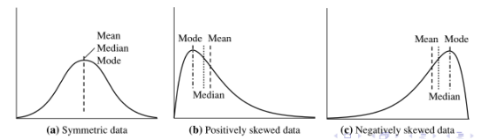

# Summarizing Data

#### **Average** : simplest and most common and estimate of central tendency.

_Pro:_ _If the samples come from a normal distribution then the average is the optimal estimate._ 

_Con:_ _Sensitive to outliers. \(could be noise, data entry error, actual outliers\)_

$$
mean(x) = \frac{1}{m}\sum_{i = 1}^{m}X_i  = \mu
$$

**Median\(中位数\):** If the samples are sorted then the demian is the value that splits the list into half

**Mode\(众数\):** the most common value in the list of samples

**Trimmed Mean:** Ignoring small percentage of highest and lowest values

**Geometric Mean\(几何平均数\):** Arithmetic mean of logarithm transformed x, it is good for positive values and output of growth rates, as most appropriate for ranking normalized results.

只适用于正数，当每个项目具有多个具有不同数值范围的属性时，几何平均数经常使用在比较不同项目，为这些项目找到单个品质因子。例如，几何平均数可以给出有意义的“平均数”以比较两家公司的环境可持续性评分为0到5，并且其财务可行性评级为0到100。如果使用算术平均数而不是几何平均数，则财务可行性给予更多权重，因为其数值范围更大 - 因此财务评级的一小部分变化（例如从80变为90）会产生更大的差异。算术平均数比环境可持续性的大比例变化（例如从2到5）。使用几何平均数“归一化”被平均的范围，使得没有范围支配加权，并且任何属性中的给定百分比变化对几何平均数具有相同的影响。

$$
GeoMean = (\prod_{i=1}^m X_i)^{\frac{1}{m}} = \exp( \frac{1}{m} \sum_{i=1}^m \log X_i) \leq mean
$$

**Harmonic Mean:** reciprocal of arithmetic mean of the reciprocals of the samples, appropriate for values that are inversely proportional to time such as speedup. 调和平均数可以用在相同距离但速度不同时，平均速度的计算, 又比如并联电路的等效电阻

$$
H = \frac{m}{\frac{1}{x_1} + \frac{1}{x_2} + ... +\frac{1}{x_m}}
$$

### Measures of Dispersion: Variance and Deviation

**Standard Deviation\(STD\) 标准差:** measure the spread of the data range

_Pros: same units as the data_

_Con: Sensitve to outliers_

$$
\sigma  = \sqrt{\frac{1}{m} \sum_{i=1}^m (X_i - \mu)^2}
$$

**Variance \(方差\):** The square of STD, 一个随机变量的方差描述的是它的离散程度，也就是该变量离其期望值的距离

$$
Var(x) = \sigma^2
$$

**Mean Absolute Deviation \(MAD\) :** less sensitive to outliers than STD \(L1 norm\)

$$
\frac{1}{m} \sum_{i=1}^m |X_i - \mu|
$$

Interquartile Range \(IQR\): Difference between 75th\(Q3\) and 25th\(Q1\) percentile of data.

**Pearson Correlation Coefficient \(PCC\)** is slightly more complicated way to analyse the relation between two attributes. it measures of how strongly one attribute implies another

$$
r = cov(v_1, v_2)/s_1s_2,~~
conv(v_1, v_2) = \frac{1}{n} (v_1 - \bar v_1)\cdot (v_2 - \bar v_2)^T
$$

r range from -1 to 1, where -1 corresponds to negative correlation, +1 corresponds to positive correlation, independence implies covariance or correlation = 0; however, in general covariance or correlation or r = 0 does not imply independence.

